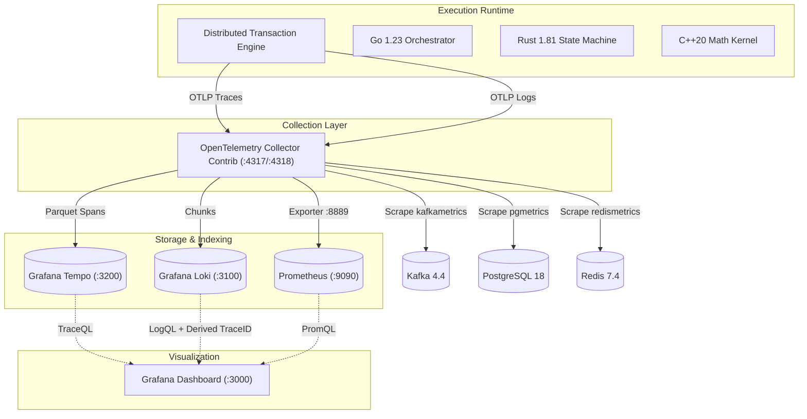
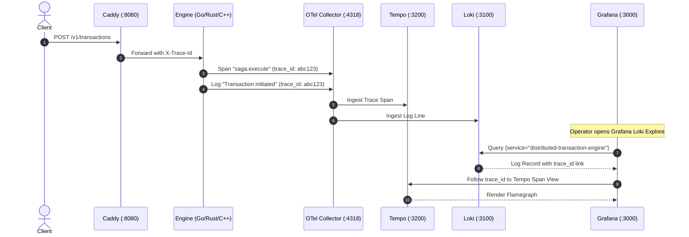

# Distributed Tracing Architecture & Signal Flow

## 1. High-Level Observability Architecture

```mermaid
graph TD
    subgraph Execution Runtime
        App["Distributed Transaction Engine"]
        GoOrch["Go 1.23 Orchestrator"]
        RustState["Rust 1.81 State Machine"]
        CppMath["C++20 Math Kernel"]
    end

    subgraph Collection Layer
        OTelCol["OpenTelemetry Collector Contrib (:4317/:4318)"]
    end

    subgraph Storage & Indexing
        Tempo[("Grafana Tempo (:3200)")]
        Loki[("Grafana Loki (:3100)")]
        Prom[("Prometheus (:9090)")]
    end

    subgraph Visualization
        Grafana["Grafana Dashboard (:3000)"]
    end

    App -->|OTLP Traces| OTelCol
    App -->|OTLP Logs| OTelCol
    OTelCol -->|Scrape kafkametrics| Kafka[("Kafka 4.4")]
    OTelCol -->|Scrape pgmetrics| PG[("PostgreSQL 18")]
    OTelCol -->|Scrape redismetrics| Redis[("Redis 7.4")]
    
    OTelCol -->|Parquet Spans| Tempo
    OTelCol -->|Chunks| Loki
    OTelCol -->|Exporter :8889| Prom
    
    Tempo -.->|TraceQL| Grafana
    Loki -.->|LogQL + Derived TraceID| Grafana
    Prom -.->|PromQL| Grafana
```

---

## 2. Trace and Log Correlation Flow

```mermaid
sequenceDiagram
    autonumber
    actor Client
    participant Gateway as Caddy (:8080)
    participant Engine as Engine (Go/Rust/C++)
    participant OTel as OTel Collector (:4318)
    participant Tempo as Tempo (:3200)
    participant Loki as Loki (:3100)
    participant Grafana as Grafana (:3000)

    Client->>Gateway: POST /v1/transactions
    Gateway->>Engine: Forward with X-Trace-Id
    Engine->>OTel: Span "saga.execute" (trace_id: abc123)
    Engine->>OTel: Log "Transaction initiated" (trace_id: abc123)
    OTel->>Tempo: Ingest Trace Span
    OTel->>Loki: Ingest Log Line
    
    Note over Grafana: Operator opens Grafana Loki Explore
    Grafana->>Loki: Query {service="distributed-transaction-engine"}
    Loki-->>Grafana: Log Record with trace_id link
    Grafana->>Tempo: Follow trace_id to Tempo Span View
    Tempo-->>Grafana: Render Flamegraph
```
