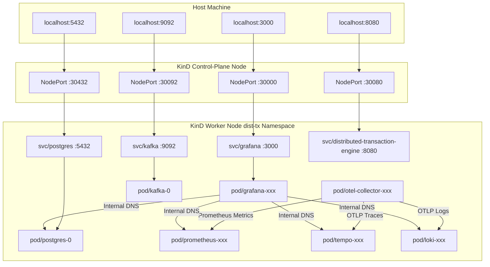

# Kubernetes Architecture Diagrams

## 1. KinD Multi-Node Ingress & Network Topology

```mermaid
graph TB
    subgraph Host Machine
        HostPort3000["localhost:3000"]
        HostPort5432["localhost:5432"]
        HostPort9092["localhost:9092"]
        HostPort8080["localhost:8080"]
    end

    subgraph KinD Control-Plane Node
        NodePort30000["NodePort :30000"]
        NodePort30432["NodePort :30432"]
        NodePort30092["NodePort :30092"]
        NodePort30080["NodePort :30080"]
    end

    subgraph KinD Worker Node dist-tx Namespace
        SvcGrafana["svc/grafana :3000"]
        SvcPG["svc/postgres :5432"]
        SvcKafka["svc/kafka :9092"]
        SvcApp["svc/distributed-transaction-engine :8080"]

        PodGrafana["pod/grafana-xxx"]
        PodPG["pod/postgres-0"]
        PodKafka["pod/kafka-0"]
        PodProm["pod/prometheus-xxx"]
        PodTempo["pod/tempo-xxx"]
        PodLoki["pod/loki-xxx"]
        PodOTel["pod/otel-collector-xxx"]
    end

    HostPort3000 --> NodePort30000 --> SvcGrafana --> PodGrafana
    HostPort5432 --> NodePort30432 --> SvcPG --> PodPG
    HostPort9092 --> NodePort30092 --> SvcKafka --> PodKafka
    HostPort8080 --> NodePort30080 --> SvcApp

    PodOTel -->|OTLP Traces| PodTempo
    PodOTel -->|OTLP Logs| PodLoki
    PodOTel -->|Prometheus Metrics| PodProm
    PodGrafana -->|Internal DNS| PodProm
    PodGrafana -->|Internal DNS| PodTempo
    PodGrafana -->|Internal DNS| PodLoki
    PodGrafana -->|Internal DNS| PodPG
```
