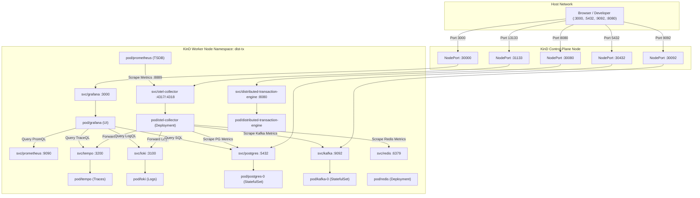
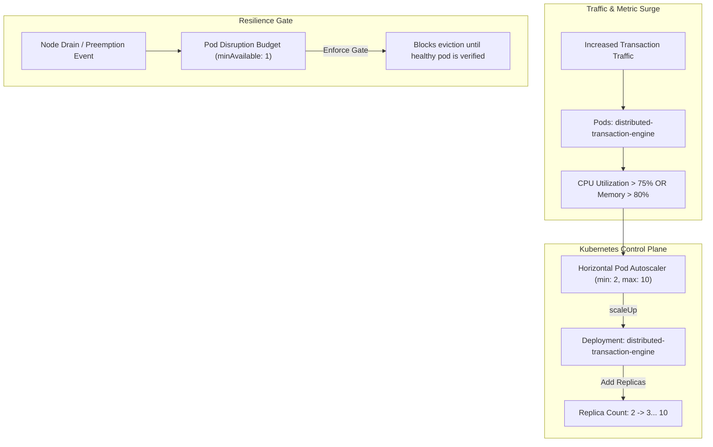

# Kubernetes Architecture & Topology Diagrams

## 1. Multi-Node KinD Networking and Ingress Architecture

```mermaid
graph TB
    subgraph Host Network
        Client["Browser / Developer (:3000, :5432, :9092, :8080)"]
    end

    subgraph KinD Control-Plane Node
        NP3000["NodePort :30000"]
        NP5432["NodePort :30432"]
        NP9092["NodePort :30092"]
        NP8080["NodePort :30080"]
        NP13133["NodePort :31133"]
    end

    subgraph KinD Worker Node Namespace: dist-tx
        SvcGrafana["svc/grafana :3000"]
        SvcProm["svc/prometheus :9090"]
        SvcTempo["svc/tempo :3200"]
        SvcLoki["svc/loki :3100"]
        SvcPG["svc/postgres :5432"]
        SvcKafka["svc/kafka :9092"]
        SvcRedis["svc/redis :6379"]
        SvcOTel["svc/otel-collector :4317/:4318"]
        SvcApp["svc/distributed-transaction-engine :8080"]

        PodGrafana["pod/grafana (UI)"]
        PodProm["pod/prometheus (TSDB)"]
        PodTempo["pod/tempo (Traces)"]
        PodLoki["pod/loki (Logs)"]
        PodPG["pod/postgres-0 (StatefulSet)"]
        PodKafka["pod/kafka-0 (StatefulSet)"]
        PodRedis["pod/redis (Deployment)"]
        PodOTel["pod/otel-collector (Deployment)"]
        PodApp["pod/distributed-transaction-engine"]
    end

    Client -->|Port 3000| NP3000 --> SvcGrafana --> PodGrafana
    Client -->|Port 5432| NP5432 --> SvcPG --> PodPG
    Client -->|Port 9092| NP9092 --> SvcKafka --> PodKafka
    Client -->|Port 8080| NP8080 --> SvcApp --> PodApp
    Client -->|Port 13133| NP13133 --> SvcOTel --> PodOTel

    PodOTel -->|Forward Traces| SvcTempo --> PodTempo
    PodOTel -->|Forward Logs| SvcLoki --> PodLoki
    PodProm -->|Scrape Metrics :8889| SvcOTel
    PodOTel -->|Scrape PG Metrics| SvcPG
    PodOTel -->|Scrape Redis Metrics| SvcRedis
    PodOTel -->|Scrape Kafka Metrics| SvcKafka

    PodGrafana -->|Query PromQL| SvcProm
    PodGrafana -->|Query TraceQL| SvcTempo
    PodGrafana -->|Query LogQL| SvcLoki
    PodGrafana -->|Query SQL| SvcPG
```

---

## 2. Horizontal Pod Autoscaling (HPA) and Disruption Flow

```mermaid
graph TD
    subgraph Traffic & Metric Surge
        Traffic["Increased Transaction Traffic"] --> Pods["Pods: distributed-transaction-engine"]
        Pods --> Metric["CPU Utilization > 75% OR Memory > 80%"]
    end

    subgraph Kubernetes Control Plane
        Metric --> HPA["Horizontal Pod Autoscaler (min: 2, max: 10)"]
        HPA -->|scaleUp| Deploy["Deployment: distributed-transaction-engine"]
        Deploy -->|Add Replicas| ScaleOut["Replica Count: 2 -> 3... 10"]
    end

    subgraph Resilience Gate
        PDB["Pod Disruption Budget (minAvailable: 1)"]
        NodeDrain["Node Drain / Preemption Event"] --> PDB
        PDB -->|Enforce Gate| Block["Blocks eviction until healthy pod is verified"]
    end
```
