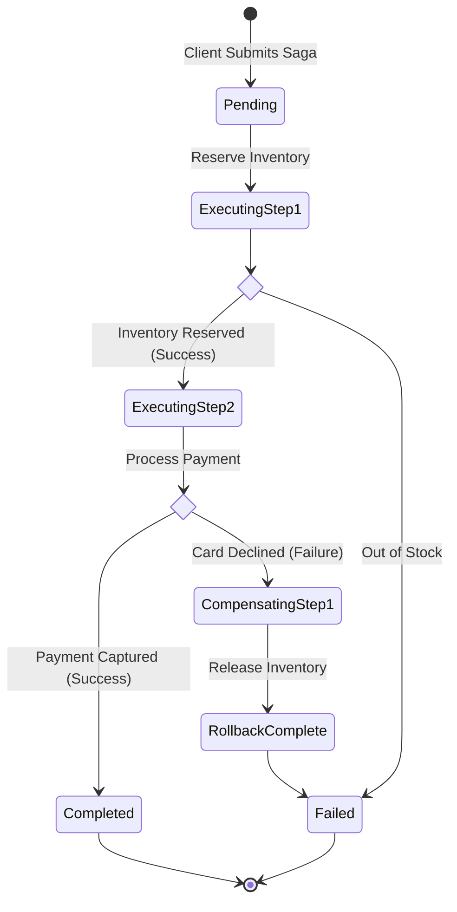
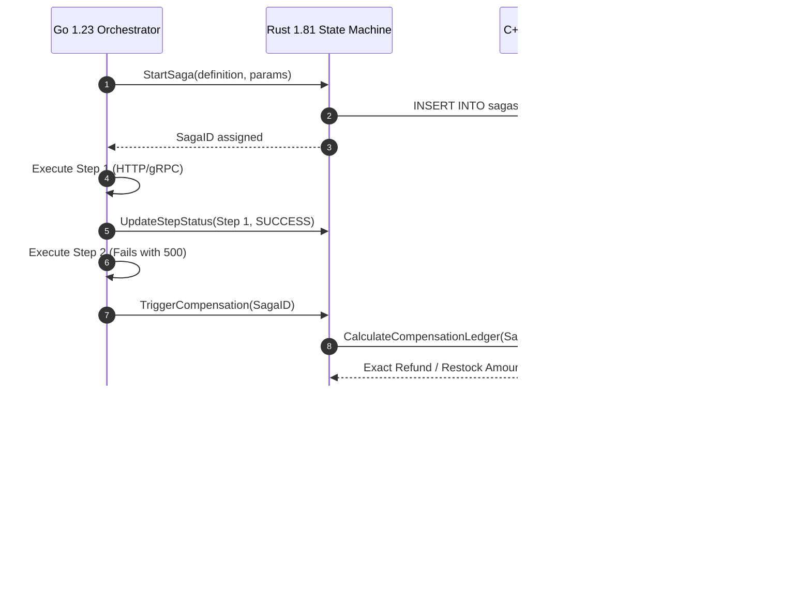

# Saga Orchestration Workflow Diagrams

## 1. Forward Execution and Compensating Rollback Flow

```mermaid
stateDiagram-v2
    [*] --> Pending: Client Submits Saga
    Pending --> ExecutingStep1: Reserve Inventory
    
    state Step1_Decision <<choice>>
    ExecutingStep1 --> Step1_Decision
    Step1_Decision --> ExecutingStep2: Inventory Reserved (Success)
    Step1_Decision --> Failed: Out of Stock
    
    state Step2_Decision <<choice>>
    ExecutingStep2 --> Step2_Decision: Process Payment
    Step2_Decision --> Completed: Payment Captured (Success)
    Step2_Decision --> CompensatingStep1: Card Declined (Failure)
    
    CompensatingStep1 --> RollbackComplete: Release Inventory
    RollbackComplete --> Failed
    
    Completed --> [*]
    Failed --> [*]
```

---

## 2. Polyglot Engine Component Interaction

```mermaid
sequenceDiagram
    autonumber
    participant Go as Go 1.23 Orchestrator
    participant Rust as Rust 1.81 State Machine
    participant Cpp as C++20 Rollback Kernel
    participant DB as PostgreSQL 18

    Go->>Rust: StartSaga(definition, params)
    Rust->>DB: INSERT INTO sagas ... (State: STARTED)
    Rust-->>Go: SagaID assigned
    
    Go->>Go: Execute Step 1 (HTTP/gRPC)
    Go->>Rust: UpdateStepStatus(Step 1, SUCCESS)
    
    Go->>Go: Execute Step 2 (Fails with 500)
    Go->>Rust: TriggerCompensation(SagaID)
    Rust->>Cpp: CalculateCompensationLedger(SagaID)
    Cpp-->>Rust: Exact Refund / Restock Amounts
    Rust->>DB: UPDATE sagas SET status = 'COMPENSATING'
    Rust-->>Go: Execute Compensations List
    Go->>Go: Run Step 1 Compensation
    Go->>Rust: MarkCompensated(SagaID)
```
