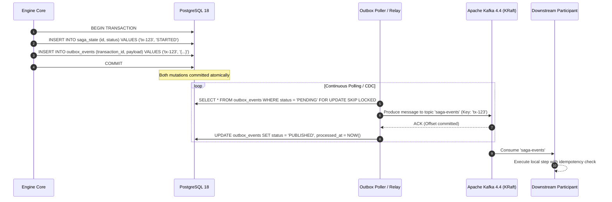
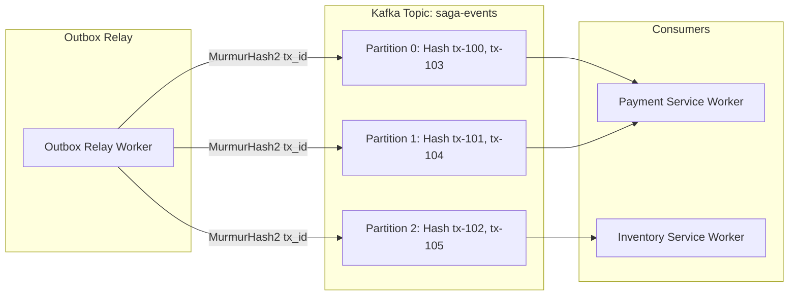

# Transactional Outbox Pattern Architecture & Diagrams

## 1. Outbox Atomic Commit and Relay Flow

```mermaid
sequenceDiagram
    autonumber
    participant App as Engine Core
    participant PG as PostgreSQL 18
    participant Relay as Outbox Poller / Relay
    participant Kafka as Apache Kafka 4.4 (KRaft)
    participant Worker as Downstream Participant

    App->>PG: BEGIN TRANSACTION
    App->>PG: INSERT INTO saga_state (id, status) VALUES ('tx-123', 'STARTED')
    App->>PG: INSERT INTO outbox_events (transaction_id, payload) VALUES ('tx-123', '{...}')
    App->>PG: COMMIT
    Note over PG: Both mutations committed atomically

    loop Continuous Polling / CDC
        Relay->>PG: SELECT * FROM outbox_events WHERE status = 'PENDING' FOR UPDATE SKIP LOCKED
        Relay->>Kafka: Produce message to topic 'saga-events' (Key: 'tx-123')
        Kafka-->>Relay: ACK (Offset committed)
        Relay->>PG: UPDATE outbox_events SET status = 'PUBLISHED', processed_at = NOW()
    end

    Kafka->>Worker: Consume 'saga-events'
    Worker-->>Worker: Execute local step with idempotency check
```

---

## 2. Kafka Partitioning & In-Order Delivery

```mermaid
graph LR
    subgraph Outbox Relay
        R[Outbox Relay Worker]
    end

    subgraph Kafka Topic: saga-events
        P0[Partition 0: Hash tx-100, tx-103]
        P1[Partition 1: Hash tx-101, tx-104]
        P2[Partition 2: Hash tx-102, tx-105]
    end

    subgraph Consumers
        C1[Payment Service Worker]
        C2[Inventory Service Worker]
    end

    R -->|MurmurHash2 tx_id| P0
    R -->|MurmurHash2 tx_id| P1
    R -->|MurmurHash2 tx_id| P2
    
    P0 --> C1
    P1 --> C1
    P2 --> C2
```
